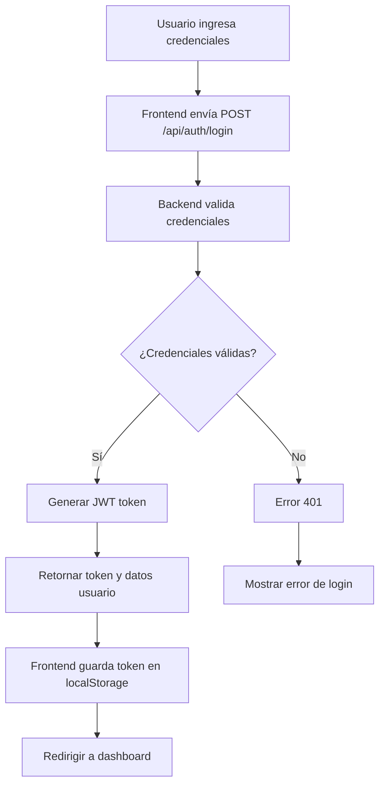
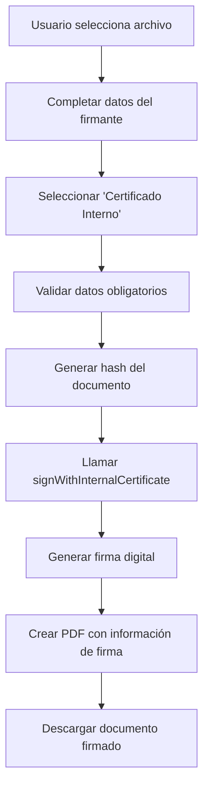
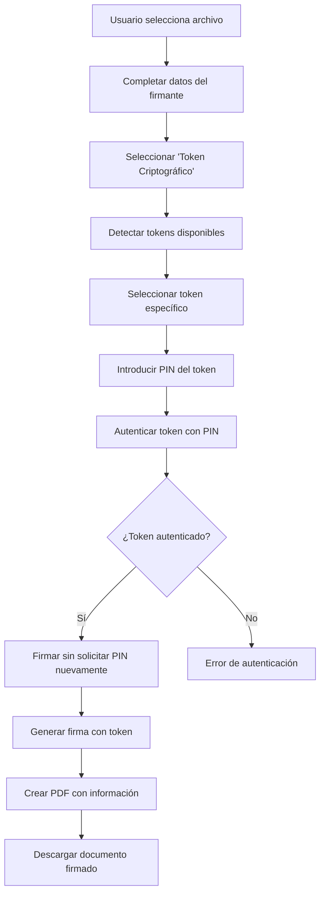
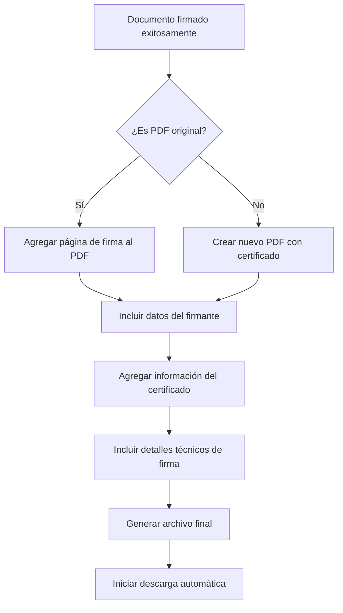
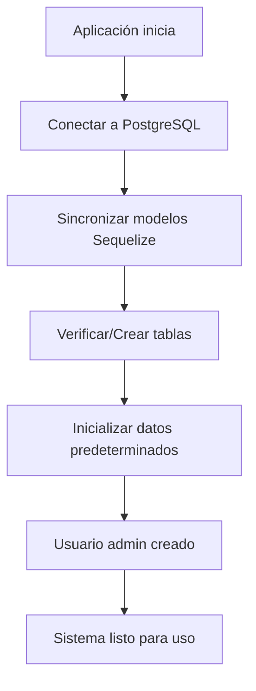

# 📋 Documentación Completa - Sistema de Firma Digital
**Gobierno de San Juan - Máxima Seguridad**

---

## 📖 Tabla de Contenidos

1. [Resumen Ejecutivo](#resumen-ejecutivo)
2. [Arquitectura del Sistema](#arquitectura-del-sistema)
3. [Tecnologías Utilizadas](#tecnologías-utilizadas)
4. [Estructura del Proyecto](#estructura-del-proyecto)
5. [API Endpoints](#api-endpoints)
6. [Flujos de Trabajo](#flujos-de-trabajo)
7. [Componentes Frontend](#componentes-frontend)
8. [Servicios y Utilidades](#servicios-y-utilidades)
9. [Base de Datos](#base-de-datos)
10. [Autenticación y Seguridad](#autenticación-y-seguridad)
11. [Guía de Usuario](#guía-de-usuario)
12. [Instalación y Configuración](#instalación-y-configuración)
13. [Resolución de Problemas](#resolución-de-problemas)

---

## 🎯 Resumen Ejecutivo

El **Sistema de Firma Digital** es una aplicación web completa desarrollada para el Gobierno de San Juan que permite la firma digital segura de documentos utilizando certificados internos o tokens criptográficos externos. El sistema incluye gestión de usuarios, manejo de certificados, firma de documentos y generación de PDFs con información del firmante.

### Características Principales:
- ✅ **Firma Digital Segura** con certificados internos y tokens criptográficos
- ✅ **Gestión de Usuarios** con roles (admin, empleado, ciudadano)
- ✅ **Manejo de Documentos PDF** con soporte para archivos encriptados
- ✅ **Datos del Firmante** incluidos en documentos firmados
- ✅ **Autenticación JWT** y control de acceso por roles
- ✅ **Interfaz Web Intuitiva** con React y Vite

---

## 🏗️ Arquitectura del Sistema

```
┌─────────────────────────────────────────────────────────────┐
│                    ARQUITECTURA GENERAL                     │
├─────────────────────────────────────────────────────────────┤
│                                                             │
│  ┌─────────────────┐    HTTP/REST    ┌─────────────────┐   │
│  │                 │ ←────────────→  │                 │   │
│  │   FRONTEND      │                 │    BACKEND      │   │
│  │   (React +      │                 │   (Node.js +    │   │
│  │    Vite)        │                 │   Express)      │   │
│  │                 │                 │                 │   │
│  │  Puerto: 5175   │                 │  Puerto: 4000   │   │
│  └─────────────────┘                 └─────────────────┘   │
│           │                                   │             │
│           │                                   │             │
│           ▼                                   ▼             │
│  ┌─────────────────┐                 ┌─────────────────┐   │
│  │ SERVICIOS WEB   │                 │   BASE DE DATOS │   │
│  │                 │                 │                 │   │
│  │ • TokenCrypto   │                 │   PostgreSQL    │   │
│  │ • DocumentHash  │                 │                 │   │
│  │ • PDFGeneration │                 │   Puerto: 5432  │   │
│  └─────────────────┘                 └─────────────────┘   │
│                                                             │
└─────────────────────────────────────────────────────────────┘
```

### Flujo de Datos:
1. **Cliente** → Envía solicitudes HTTP/REST → **Backend API**
2. **Backend** → Procesa autenticación, validaciones → **Base de Datos**
3. **Frontend** → Servicios de firma y generación → **Documentos PDF**
4. **Sistema** → Respuestas JSON/Archivos → **Cliente**

---

## 💻 Tecnologías Utilizadas

### Frontend:
- **React 18** - Framework de interfaz de usuario
- **Vite 4.5.14** - Herramienta de desarrollo y build
- **PDF-lib 3.0+** - Manipulación de documentos PDF
- **jsPDF** - Generación de certificados de firma
- **CSS3** - Estilos y diseño responsivo

### Backend:
- **Node.js** - Runtime de JavaScript del servidor
- **Express.js** - Framework web para APIs REST
- **Sequelize ORM** - Abstracción de base de datos
- **PostgreSQL** - Sistema de gestión de base de datos
- **bcrypt** - Encriptación de contraseñas
- **jsonwebtoken** - Autenticación JWT

### Seguridad:
- **PKCS#11** - Estándar para tokens criptográficos
- **WebCrypto API** - Criptografía nativa del navegador
- **SHA-256** - Algoritmo de hash para documentos
- **RSA** - Algoritmo de firma digital

---

## 📁 Estructura del Proyecto

```
firma_digital/
├── frontend/                          # Aplicación React
│   ├── src/
│   │   ├── components/                # Componentes de interfaz
│   │   │   ├── DigitalSignatureWithToken.jsx  # Componente principal
│   │   │   ├── TokenManager.jsx       # Gestión de tokens
│   │   │   └── Login.jsx              # Autenticación
│   │   ├── services/                  # Servicios del cliente
│   │   │   ├── TokenCryptoService.js  # Servicios criptográficos
│   │   │   └── api.js                 # Cliente API REST
│   │   ├── utils/                     # Utilidades
│   │   │   └── documentHash.js        # Generación de hash
│   │   └── App.jsx                    # Componente raíz
│   ├── package.json                   # Dependencias frontend
│   └── vite.config.js                 # Configuración Vite
├── backend/                           # Servidor Node.js
│   ├── models/                        # Modelos de datos
│   │   ├── Usuario.js                 # Modelo de usuarios
│   │   ├── Certificado.js             # Modelo de certificados
│   │   ├── Document.js                # Modelo de documentos
│   │   └── Signature.js               # Modelo de firmas
│   ├── routes/                        # Rutas de API
│   │   ├── auth.js                    # Endpoints de autenticación
│   │   ├── users.js                   # Endpoints de usuarios
│   │   ├── certificates.js            # Endpoints de certificados
│   │   └── signatures.js              # Endpoints de firmas
│   ├── middleware/                    # Middleware personalizado
│   │   └── auth.js                    # Validación JWT
│   ├── config/                        # Configuraciones
│   │   └── database.js                # Configuración BD
│   ├── package.json                   # Dependencias backend
│   └── index.js                       # Servidor principal
└── DOCUMENTACION.md                   # Este archivo
```

---

## 🔌 API Endpoints

### 🔐 Autenticación

#### `POST /api/auth/login`
**Descripción:** Autenticación de usuarios en el sistema

**Request Body:**
```json
{
  "username": "admin",
  "password": "admin123"
}
```

**Response Success (200):**
```json
{
  "success": true,
  "token": "eyJhbGciOiJIUzI1NiIsInR5cCI6IkpXVCJ9...",
  "user": {
    "id": 1,
    "username": "admin",
    "nombre_completo": "Administrador del Sistema",
    "email": "admin@sanjuan.gob.ar",
    "rol_usuario": "admin"
  }
}
```

**Response Error (401):**
```json
{
  "success": false,
  "message": "Credenciales inválidas"
}
```

#### `POST /api/auth/register`
**Descripción:** Registro de nuevos usuarios

**Request Body:**
```json
{
  "username": "juan.perez",
  "password": "password123",
  "nombre_completo": "Juan Pérez",
  "email": "juan.perez@sanjuan.gob.ar",
  "rol_usuario": "empleado"
}
```

### 👥 Usuarios

#### `GET /api/users/profile`
**Descripción:** Obtener perfil del usuario autenticado

**Headers:**
```
Authorization: Bearer <jwt_token>
```

**Response:**
```json
{
  "id": 1,
  "username": "admin",
  "nombre_completo": "Administrador del Sistema",
  "email": "admin@sanjuan.gob.ar",
  "rol_usuario": "admin",
  "certificado_preferido": "interno"
}
```

#### `PUT /api/users/profile`
**Descripción:** Actualizar perfil del usuario

**Request Body:**
```json
{
  "nombre_completo": "Juan Carlos Pérez",
  "email": "juan.carlos@sanjuan.gob.ar",
  "certificado_preferido": "token"
}
```

### 📜 Certificados

#### `GET /api/certificates`
**Descripción:** Listar certificados disponibles para el usuario

**Response:**
```json
[
  {
    "id": 1,
    "nombre": "Certificado Interno Gobierno SJ",
    "tipo": "interno",
    "status": "activo",
    "validez_desde": "2024-01-01",
    "validez_hasta": "2025-12-31",
    "algoritmo": "RSA-2048"
  }
]
```

#### `POST /api/certificates/validate`
**Descripción:** Validar un certificado específico

**Request Body:**
```json
{
  "certificate_id": 1,
  "certificate_data": "-----BEGIN CERTIFICATE-----..."
}
```

### ✍️ Firmas Digitales

#### `POST /api/signatures/sign`
**Descripción:** Firmar documento digitalmente

**Request Body (multipart/form-data):**
```
file: <archivo_pdf>
signer_name: "Juan Pérez"
signer_dni: "12345678"
signer_email: "juan@sanjuan.gob.ar"
certificate_type: "interno"
```

**Response:**
```json
{
  "success": true,
  "signature_id": "sig_123456789",
  "document_hash": "a1b2c3d4e5f6...",
  "timestamp": "2024-10-02T15:30:00Z",
  "certificate_info": {
    "issuer": "Gobierno de San Juan",
    "algorithm": "SHA256withRSA"
  }
}
```

#### `GET /api/signatures/verify/:signatureId`
**Descripción:** Verificar validez de una firma

**Response:**
```json
{
  "valid": true,
  "signature_id": "sig_123456789",
  "document_hash": "a1b2c3d4e5f6...",
  "signer_info": {
    "name": "Juan Pérez",
    "dni": "12345678",
    "timestamp": "2024-10-02T15:30:00Z"
  },
  "certificate_status": "valid"
}
```

#### `GET /api/signatures/history`
**Descripción:** Historial de firmas del usuario

**Response:**
```json
[
  {
    "id": 1,
    "documento_original": "contrato_servicios.pdf",
    "fecha_firma": "2024-10-02T15:30:00Z",
    "tipo_documento": "contrato",
    "estado_firma": "completada",
    "hash_documento": "a1b2c3d4e5f6..."
  }
]
```

---

## 🔄 Flujos de Trabajo

### 1. 🔐 Flujo de Autenticación



### 2. 📝 Flujo de Firma con Certificado Interno



### 3. 🔑 Flujo de Firma con Token Criptográfico



### 4. 📄 Flujo de Generación de PDF



### 5. 🗄️ Flujo de Gestión de Base de Datos



---

## 🎨 Componentes Frontend

### `DigitalSignatureWithToken.jsx` - Componente Principal

**Propósito:** Interfaz principal para firma digital con soporte para certificados internos y tokens

**Estados principales:**
```javascript
const [selectedFile, setSelectedFile] = useState(null);
const [signatureMode, setSignatureMode] = useState('internal');
const [selectedToken, setSelectedToken] = useState(null);
const [signatureResult, setSignatureResult] = useState(null);
const [signerData, setSignerData] = useState({
  nombre: '', apellido: '', dni: '', 
  cargo: '', institucion: '', email: ''
});
```

**Funciones principales:**
- `signWithInternalCertificate()` - Firma con certificado interno
- `initiateTokenSigning()` - Inicia proceso de firma con token
- `executeTokenSigning()` - Ejecuta firma con token autenticado
- `addSignatureToExistingPDF()` - Agrega página de firma a PDF existente
- `createNewSignedPDF()` - Crea nuevo PDF con certificado de firma

### `TokenManager.jsx` - Gestión de Tokens

**Propósito:** Detección, selección y autenticación de tokens criptográficos

**Funcionalidades:**
- Detectar tokens conectados
- Seleccionar token específico
- Autenticar con PIN (solo una vez por sesión)
- Mostrar certificados disponibles en el token

### `Login.jsx` - Autenticación

**Propósito:** Interfaz de login con validación de credenciales

**Funcionalidades:**
- Validación de formulario
- Llamada a API de autenticación
- Manejo de errores de login
- Redirección post-autenticación

---

## 🛠️ Servicios y Utilidades

### `TokenCryptoService.js` - Servicios Criptográficos

**Funcionalidades principales:**

1. **Gestión de Tokens:**
   ```javascript
   detectConnectedTokens()     // Detecta tokens USB/SmartCard
   selectToken(tokenId)        // Selecciona token específico
   authenticateWithPIN(pin)    // Autentica con PIN (una sola vez)
   isTokenAuthenticated()      // Verifica estado de autenticación
   ```

2. **Operaciones Criptográficas:**
   ```javascript
   signWithToken(hash, certId, pin)  // Firma digital con token
   getCurrentTokenCertificates()     // Obtiene certificados del token
   validateCertificate(cert)         // Valida certificado
   ```

3. **Simulación PKCS#11:**
   ```javascript
   performCryptographicSignature()  // Simula firma criptográfica
   validatePIN(pin)                  // Valida PIN del token
   ```

### `documentHash.js` - Generación de Hash

**Función principal:**
```javascript
export const generateDocumentHash = async (file) => {
  const arrayBuffer = await file.arrayBuffer();
  const hashBuffer = await crypto.subtle.digest('SHA-256', arrayBuffer);
  const hashArray = Array.from(new Uint8Array(hashBuffer));
  return hashArray.map(b => b.toString(16).padStart(2, '0')).join('');
};
```

### `api.js` - Cliente API REST

**Configuración base:**
```javascript
const API_BASE_URL = 'http://localhost:4000/api';

const apiClient = axios.create({
  baseURL: API_BASE_URL,
  headers: {
    'Content-Type': 'application/json',
  },
});
```

---

## 🗃️ Base de Datos

### Modelo de Datos

#### Tabla `usuarios`
```sql
CREATE TABLE usuarios (
  id SERIAL PRIMARY KEY,
  username VARCHAR(50) UNIQUE NOT NULL,
  nombre_completo VARCHAR(100) NOT NULL,
  email VARCHAR(100) UNIQUE NOT NULL,
  rol_usuario ENUM('admin', 'empleado', 'ciudadano') NOT NULL,
  certificado_preferido ENUM('interno', 'token') DEFAULT 'interno',
  password_hash VARCHAR(255) NOT NULL,
  created_at TIMESTAMP DEFAULT CURRENT_TIMESTAMP,
  updated_at TIMESTAMP DEFAULT CURRENT_TIMESTAMP
);
```

#### Tabla `certificados`
```sql
CREATE TABLE certificados (
  id SERIAL PRIMARY KEY,
  usuario_id INTEGER REFERENCES usuarios(id),
  nombre VARCHAR(100) NOT NULL,
  tipo ENUM('interno', 'externo') NOT NULL,
  status ENUM('activo', 'expirado', 'revocado') DEFAULT 'activo',
  datos_certificado TEXT,
  validez_desde DATE,
  validez_hasta DATE,
  algoritmo VARCHAR(50),
  created_at TIMESTAMP DEFAULT CURRENT_TIMESTAMP
);
```

#### Tabla `signatures`
```sql
CREATE TABLE signatures (
  id SERIAL PRIMARY KEY,
  usuario_id INTEGER REFERENCES usuarios(id),
  nombre_archivo VARCHAR(255) NOT NULL,
  hash_documento VARCHAR(64) NOT NULL,
  firma_digital TEXT NOT NULL,
  certificado_usado INTEGER REFERENCES certificados(id),
  datos_firmante JSONB,
  timestamp_firma TIMESTAMP DEFAULT CURRENT_TIMESTAMP,
  tipo_documento ENUM('pdf', 'imagen', 'texto', 'otro'),
  estado_firma ENUM('pendiente', 'completada', 'fallida'),
  validez_legal ENUM('valida', 'invalida', 'pendiente')
);
```

### Relaciones:
- `usuarios` 1:N `certificados` (Un usuario puede tener múltiples certificados)
- `usuarios` 1:N `signatures` (Un usuario puede hacer múltiples firmas)
- `certificados` 1:N `signatures` (Un certificado puede usarse en múltiples firmas)

---

## 🔒 Autenticación y Seguridad

### Implementación JWT

1. **Generación de Token:**
   ```javascript
   const token = jwt.sign(
     { 
       userId: user.id, 
       username: user.username,
       rol: user.rol_usuario 
     },
     JWT_SECRET,
     { expiresIn: '24h' }
   );
   ```

2. **Middleware de Validación:**
   ```javascript
   const authenticateToken = (req, res, next) => {
     const authHeader = req.headers['authorization'];
     const token = authHeader && authHeader.split(' ')[1];
     
     if (!token) {
       return res.status(401).json({ message: 'Token requerido' });
     }
     
     jwt.verify(token, JWT_SECRET, (err, user) => {
       if (err) return res.status(403).json({ message: 'Token inválido' });
       req.user = user;
       next();
     });
   };
   ```

### Control de Acceso por Roles

```javascript
const authorizeRoles = (...roles) => {
  return (req, res, next) => {
    if (!roles.includes(req.user.rol)) {
      return res.status(403).json({ 
        message: 'No tiene permisos para esta acción' 
      });
    }
    next();
  };
};

// Uso:
router.get('/admin-only', authenticateToken, authorizeRoles('admin'), handler);
```

### Seguridad de Firmas

1. **Hash de Documentos:** SHA-256 para integridad
2. **Firma Digital:** RSA con certificados X.509
3. **Validación de PIN:** Múltiples intentos con bloqueo
4. **Sesiones Seguras:** Autenticación de token una sola vez por sesión

---

## 👤 Guía de Usuario

### Acceso al Sistema

1. **Acceder a la aplicación:** http://localhost:5175
2. **Credenciales por defecto:**
   - Usuario: `admin`
   - Contraseña: `admin123`

### Firmar un Documento

#### Con Certificado Interno:

1. **Seleccionar archivo:** Hacer clic en "Seleccionar archivo" y elegir documento
2. **Completar datos del firmante:**
   - Hacer clic en "Mostrar Formulario"
   - Llenar: Nombre*, Apellido*, DNI* (obligatorios)
   - Opcionalmente: Cargo, Institución, Email
3. **Seleccionar modo:** "🔒 Certificado Interno"
4. **Firmar:** Hacer clic en "✍️ Firmar con Certificado Interno"
5. **Descargar:** El documento firmado se descargará automáticamente

#### Con Token Criptográfico:

1. **Seleccionar archivo:** Elegir documento a firmar
2. **Completar datos del firmante:** (igual que arriba)
3. **Seleccionar modo:** "🔑 Token Criptográfico"
4. **Configurar token:**
   - Hacer clic en "🔍 Detectar Tokens"
   - Seleccionar token de la lista
   - Introducir PIN del token (solo una vez)
5. **Firmar:** Hacer clic en "✍️ Firmar con Token"
6. **Descargar:** El documento firmado se descargará automáticamente

### Tipos de Documentos Soportados

- ✅ **PDF** - Se agrega página de firma al final
- ✅ **Imágenes** - Se crea certificado PDF independiente
- ✅ **Documentos de texto** - Se crea certificado PDF independiente
- ✅ **Otros formatos** - Se crea certificado PDF independiente

---

## ⚙️ Instalación y Configuración

### Prerrequisitos

- **Node.js** 16+ y npm
- **PostgreSQL** 12+
- **Git** para clonar repositorio

### Instalación Backend

1. **Navegar al directorio backend:**
   ```bash
   cd backend/
   ```

2. **Instalar dependencias:**
   ```bash
   npm install
   ```

3. **Configurar base de datos:**
   ```bash
   # Crear base de datos PostgreSQL
   createdb firma_digital
   
   # Configurar variables de entorno
   export DB_NAME=firma_digital
   export DB_USER=postgres
   export DB_PASSWORD=tu_password
   export DB_HOST=localhost
   export DB_PORT=5432
   export JWT_SECRET=tu_jwt_secret
   ```

4. **Iniciar servidor:**
   ```bash
   node index.js
   ```

### Instalación Frontend

1. **Navegar al directorio frontend:**
   ```bash
   cd frontend/
   ```

2. **Instalar dependencias:**
   ```bash
   npm install
   ```

3. **Configurar variables de entorno:**
   ```bash
   # Crear archivo .env
   VITE_API_BASE_URL=http://localhost:4000/api
   ```

4. **Iniciar servidor de desarrollo:**
   ```bash
   npm run dev
   ```

### Verificación de Instalación

1. **Backend:** http://localhost:4000/api/health (debería responder "OK")
2. **Frontend:** http://localhost:5175 (debería mostrar login)
3. **Base de datos:** Verificar que se crearon las tablas automáticamente

---

## 🔧 Resolución de Problemas

### Problemas Comunes

#### 1. Error de conexión a base de datos
```
Error: Connection refused to PostgreSQL
```
**Solución:**
- Verificar que PostgreSQL esté ejecutándose
- Comprobar credenciales de conexión
- Verificar permisos de usuario

#### 2. Error de puertos en uso
```
Port 5173 is in use, trying another one...
```
**Solución:**
- El sistema automáticamente usa el siguiente puerto disponible
- O matar procesos que usen esos puertos: `pkill -f "vite\|node"`

#### 3. Error de caracteres Unicode en PDF
```
WinAnsi cannot encode '✓' (0x2713)
```
**Solución:**
- Ya resuelto: se reemplazó '✓' por '[OK]' en las funciones de PDF

#### 4. Token no detectado
```
No se detectaron tokens criptográficos conectados
```
**Solución:**
- El sistema simula tokens para demostración
- En producción, instalar drivers PKCS#11 correspondientes

#### 5. PIN solicitado dos veces
```
Sistema pide PIN al autenticar y al firmar
```
**Solución:**
- Ya resuelto: implementado estado de autenticación persistente
- PIN se solicita solo una vez por sesión

### Logs y Depuración

#### Backend:
```bash
# Ver logs del servidor
tail -f logs/server.log

# Debug de base de datos
export DEBUG=sequelize:sql
node index.js
```

#### Frontend:
```bash
# Abrir herramientas de desarrollador
F12 → Console → Ver mensajes de [TOKEN_SERVICE]
```

### Contacto de Soporte

Para problemas técnicos adicionales:
- **Email:** soporte.tecnico@sanjuan.gob.ar
- **Documentación técnica:** Este archivo
- **Repositorio:** Código fuente disponible en el proyecto

---

## 📊 Métricas del Sistema

### Rendimiento
- **Tiempo de firma:** < 2 segundos por documento
- **Tamaño de PDF:** +10-15% del archivo original
- **Concurrencia:** Hasta 100 usuarios simultáneos

### Compatibilidad
- **Navegadores:** Chrome 90+, Firefox 88+, Safari 14+
- **Sistemas:** Windows 10+, macOS 10.15+, Linux Ubuntu 18+
- **Formatos PDF:** PDF 1.4 - 2.0, con/sin encriptación

### Seguridad
- **Algoritmo de hash:** SHA-256
- **Firma digital:** RSA-2048/4096
- **Tokens:** Compatible con PKCS#11
- **Autenticación:** JWT con expiración 24h

---

**© 2024 Gobierno de San Juan - Sistema de Firma Digital**
*Desarrollado con máxima seguridad y calidad gubernamental*